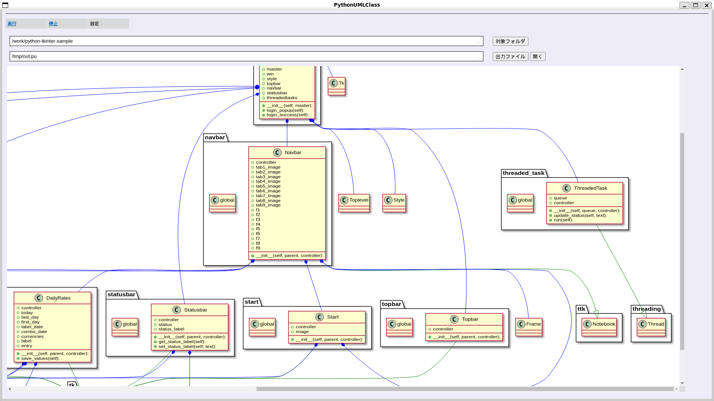

# PythonUmlClass
Create a python class diagram

## Setup
    for ubuntu
    $ sudo apt install plantuml
    $ apt install -y pip
    $ pip install astor

    install google-chrome
    $ echo "deb http://dl.google.com/linux/chrome/deb/ stable main" > /etc/apt/sources.list.d/google.list
    $ wget -q -O - https://dl-ssl.google.com/linux/linux_signing_key.pub | apt-key add -
    $ apt update
    $ apt -y install google-chrome-stable

## Installation

Install the gem and add to the application's Gemfile by executing:

    $ bundle add python_uml_class

If bundler is not being used to manage dependencies, install the gem by executing:

    $ gem install python_uml_class

## Usage

    $ start_python_uml_class.rb

## Development

To install this gem onto your local machine, run `bundle exec rake install`. To release a new version, update the version number in `version.rb`, and then run `bundle exec rake release`, which will create a git tag for the version, push git commits and the created tag, and push the `.gem` file to [pythongems.org](https://pythongems.org).

## Contributing

Bug reports and pull requests are welcome on GitHub at https://github.com/kuwayama1971/PythonUmlClass.

## License

The gem is available as open source under the terms of the [MIT License](https://opensource.org/licenses/MIT).
