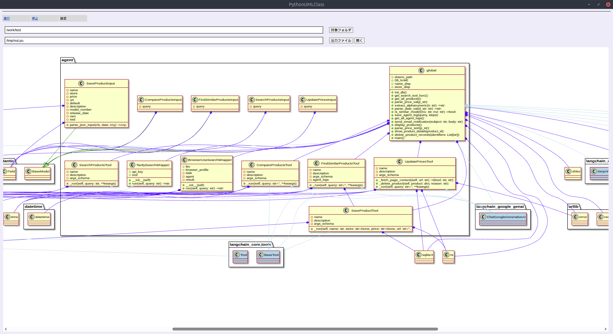

# PythonUmlClass
Pythonのクラス図を作成します。

他の言語で読む: [English](README.md), [日本語](README_JA.md)

## セットアップ
    Ubuntuの場合
    $ sudo apt install plantuml
    $ apt install -y pip
    $ pip install astor

    Google Chromeのインストール
    $ echo "deb http://dl.google.com/linux/chrome/deb/ stable main" > /etc/apt/sources.list.d/google.list
    $ wget -q -O - https://dl-ssl.google.com/linux/linux_signing_key.pub | apt-key add -
    $ apt update
    $ apt -y install google-chrome-stable

## インストール

アプリケーションのGemfileに以下を追加してインストールします:

    $ bundle add python_uml_class

bundlerを使用していない場合は、以下のコマンドでgemをインストールします:

    $ gem install python_uml_class

## 使用方法

    $ start_python_uml_class.rb



## Dockerでのテスト環境構築

Dockerを使用して開発・テスト環境（Ubuntu 22.04、および24.04）を構築できます。

1. `test/docker/ubuntu` に移動します。
    ```bash
    $ cd test/docker/ubuntu
    ```

2. docker composeを使用してコンテナをビルド・起動します。
   - Ubuntu 22.04 の場合:
     ```bash
     $ docker compose up -d --build
     ```
   - Ubuntu 24.04 の場合:
     ```bash
     $ docker compose -f docker-compose-24.04.yml up -d --build
     ```

3. コンテナにログインしてテストやアプリケーションの実行を行います。（ソースコードはコンテナ内の `/work` にマウントされています）
   - Ubuntu 22.04 の場合:
     ```bash
     $ docker exec -it ubuntu bash
     ```
   - Ubuntu 24.04 の場合:
     ```bash
     $ docker exec -it ubuntu-24.04 bash
     ```

4. コンテナ内でテストを実行します。
    ```bash
    $ cd /work
    $ bundle install
    $ bundle exec rspec
    ```

## 開発

このgemをローカルマシンにインストールするには、`bundle exec rake install`を実行します。新しいバージョンをリリースするには、`version.rb`のバージョン番号を更新してから、`bundle exec rake release`を実行します。これにより、バージョンのgitタグが作成され、コミットとタグがプッシュされ、`.gem`ファイルが[pythongems.org](https://pythongems.org)にプッシュされます。

## コントリビューション

バグレポートとプルリクエストはGitHub https://github.com/kuwayama1971/PythonUmlClass で歓迎します。

## ライセンス

このgemは[MIT License](https://opensource.org/licenses/MIT)の条件の下でオープンソースとして利用可能です。